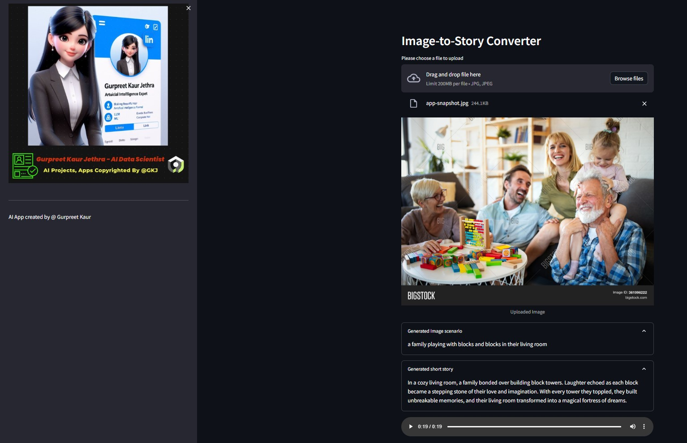

# Image-to-Speech Generative AI Tool Using LLM
This AI-powered application transforms images into narrated audio stories by leveraging Generative AI models. It integrates Hugging Face models with OpenAI & LangChain to generate meaningful audio narratives based on uploaded images. The tool is deployed on Streamlit and Hugging Face Cloud as separate instances.

## 🎯 Demo:


You can find the corresponding audio output for each test image in the `img-audio` folder.

## 📈 System Architecture


## 🏆 Methodology
This application follows a three-step process to generate an audio story from an image using advanced AI models:

1. **Image to Text Conversion:**
   - The system utilizes an image-captioning model ([Salesforce/blip-image-captioning-base](https://huggingface.co/Salesforce/blip-image-captioning-base)) from Hugging Face to analyze the image and generate a descriptive textual scenario.
   
2. **Text to Narrative Generation:**
   - The extracted text is passed as a prompt to OpenAI's LLM ([gpt-3.5-turbo](https://platform.openai.com/docs/models/gpt-3-5)), which creates a short engaging story (default length: 50 words, customizable as needed).
   
3. **Story to Speech Conversion:**
   - A text-to-speech model ([espnet/kan-bayashi_ljspeech_vits](https://huggingface.co/espnet/kan-bayashi_ljspeech_vits)) is then used to generate an audio narration of the AI-generated story.

A user-friendly interface is built with Streamlit, allowing users to upload images and listen to the resulting audio.


You can access the respective audio files for each test image in the `img-audio` folder.

## 🌟 Dependencies

- os
- python-dotenv
- transformers
- torch
- langchain
- openai
- requests
- streamlit
  
## 🚀 How to Use

1. Ensure you have valid API tokens for Hugging Face and OpenAI.
2. Set up a virtual environment and install the `ipykernel` library for running the application locally.
3. Store your personal tokens in an `.env` file in the project root with the following entries:
   ```
   OPENAI_API_KEY=<your-api-key>
   HUGGINGFACE_API_TOKEN=<your-access-token>
   ```
4. Start the application by running:
   ```
   streamlit run app.py
   ```
5. Upload an image, and the AI model will process it to generate:
   - A textual description from the image-captioning model
   - A short story generated by OpenAI LLM
   - An audio narration of the story
6. The application is deployed on both Streamlit Cloud and Hugging Face Spaces.


## ▶️ Installation Guide

Clone the repository:
```sh
 git clone <repository-url>
```

Install required dependencies:
```sh
 pip install -r requirements.txt
```

Set up API credentials by creating a `.env` file:
```sh
 OPENAI_API_KEY=<your-api-key>
 HUGGINGFACE_API_TOKEN=<your-access-token>
```

Launch the Streamlit application:
```sh
 streamlit run app.py
```

---
This project showcases the powerful synergy of multimodal AI models, creating a seamless pipeline from visual input to audio storytelling. 🚀

